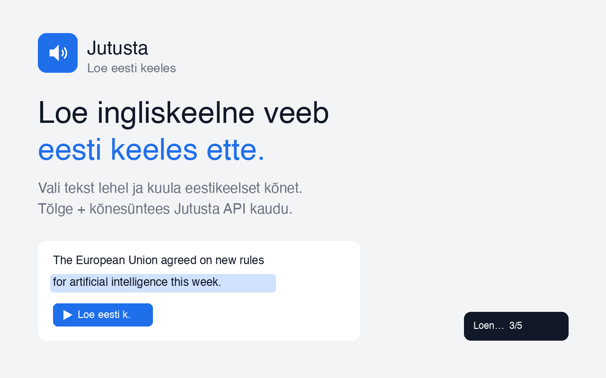

# Jutusta — Loe eesti keeles (Chrome-laiendus)

Vali veebilehel ingliskeelne (või muu) tekst ja lase see **eesti keeles ette lugeda**. Laiendus tõlgib valiku Jutusta `/translate/chunk` kaudu ja loeb ette `/text-to-speech` kaudu — heli mängib järjest, järgmist lõiku genereeritakse juba eelmise mängimise ajal.



## Paigaldus (arendusrežiim)

1. Ava Chrome → `chrome://extensions`
2. Lülita sisse **Developer mode** (üleval paremal)
3. **Load unpacked** → vali see kaust (`jutusta-loe-ext`)
4. Klõpsa laienduse ikoonil → **Ava seaded** → sisesta **API võti** (`sk_jt_…`, jutusta.ee → Arendajatele), vali hääl ja salvesta. **Testi häält** kontrollib, et võti töötab.

## Kasutamine

Vali lehel tekst, siis kas:
- klõpsa ilmuvat **🔊 Loe eesti k.** nuppu, või
- **paremklõps** → „Loe eesti keeles ette“, või
- vajuta **Alt+Shift+R**.

Peatamiseks vajuta **Esc** või klõpsa olekuriba **Peata** nuppu (all paremas).

## Seaded
- **Hääl** — 12 eestikeelset Jutusta häält (mehed/naised)
- **Lähte-/sihtkeel** — vaikimisi `en → et`; lähtekeeleks võib panna nt `de`, `ru`
- **Kõnetempo** — 0.5×–2×

## Arhitektuur
- `background.js` — service worker; teeb API-kõned (host_permissions → CORS-vaba), proksib content-scriptile
- `content.js` — püüab valiku, näitab nuppu, tükeldab teksti lauseteks, mängib heli järjest
- `options.html/js` — API võti + hääl + keeled + tempo (`chrome.storage.local`)
- `popup.html/js` — kiirstaatus + seadete link

## Käsurea-tööriist (CLI)
Sama loogika terminalist — vt [`cli/`](cli/): `loe <URL>` laeb lehe, tõlgib ja loeb eesti keeles ette (macOS).

## Chrome Web Store
Avaldamise materjalid ja sammud: [`STORE.md`](STORE.md). Üleslaaditava paketi ehitamine:
```bash
bash tools/build-zip.sh   # → dist/jutusta-loe-ext.zip
```
Ikoonid/promo regenereerimine: `tools/make_icons.py`, `tools/make_promo.py` (vajab Pillow'd).

## Märkused
- API võti on salvestatud `chrome.storage.local`-i — see on selle brauseriprofiili sees nähtav (devtools/teised laiendused). Sobib isiklikuks kasutuseks.
- Kloonitud häältega töötab samuti (sisesta seadetes nende `voice_id`).
- Tõlke `source` ei tohi olla `auto` — pane konkreetne ISO kood.
- Privaatsuspoliitika: [`PRIVACY.md`](PRIVACY.md).
